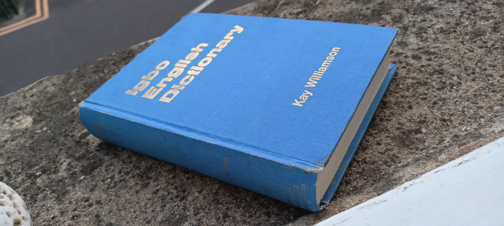

# Igbo English Dictionary

Pages from Igbo English dictionary published in 1972 by Kay Williamson with significant contribution from Prof. E. Nolue Emenanjo

## Provided the book was published in 1972 and today it's 2022, the conventional copyright of 50 years expires right about now

It isn't my intention to publish this book in free access though. If it should be done, it shoud be done by someone with actual Igbo identity, and awareness of historical/cultural/ethical context.

I do find this book interesting though, and will just put here first few pages.

[i. Title page](i1-title.md)  
[ii-iii. Acknowledgements and Table of Contents](i2-3-acknowledgements.md)  
[iv-v. Introduction](i4-5-toc-introduction.md)  