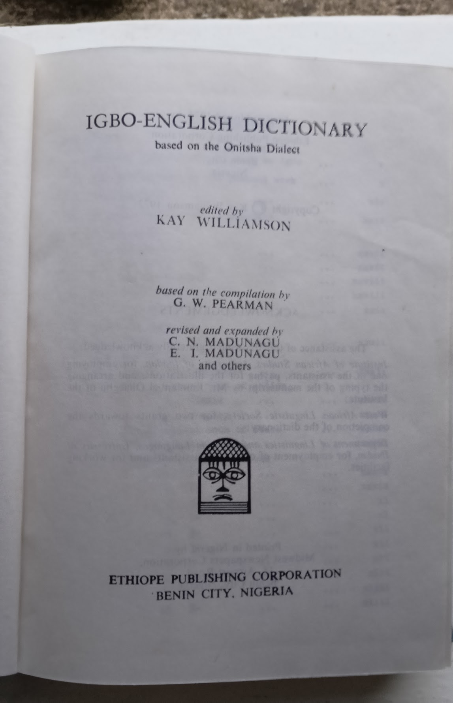

# Title page

IGBO-ENGLISH DICTIONARY
based on the Onitsha Dialect
edited by KAY WILLIAMSON
based on the compilation by G. W. PEARMAN
revised and expanded by
C. N. MADUNAGU
E. I. MADUNAGU
and others

ETHIOPE PUBLISHING CORPORATION
BENIN CITY, NIGERIA

