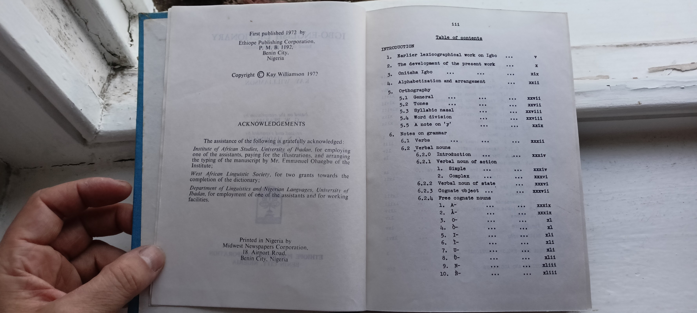

# Acknowledgements and Table of Contents

First published 1972 by
Ethiope Publishing Corporation,
P. M. B. 1192.
Benin City. Nigeria
Copyright Kay Williamson 1972

ACKNOWLEDGEMENTS

The assistance of the following is gratefully acknowledged:
Institute of African Studies, University of Thadan, for employing one of the assistants, paying for the illustrations, and arranging the typing of the manuscript by Mr. Emmanuel Ohaegbu of the Institute;
West African Linguistic Society, for two grants towards the completion of the dictionary:
Department of Linguistics and Nigerian Languages, University of Ibadan, for employment of one of the assistants and for working facilities.

Printed in Nigeria by
Midwest Newspapers Corporation.
18 Airport Road.
Benin City. Nigeria

111
Table of contents
INTRODUCTION
1. Earlier lexicographical work on Igbo
2. The development of the present work
3. Onitsha Igbo
4. Alphabetization and arrangement
5. Orthography
5.1 General
5.2 Tones 5.3 Syllabic nasal
5.4 Word division
5.5 A note on 'y'
6. Notes on grammar
6.1 Verba
6.2 Verbal nouns
6.2.0 Introduction
6.2.1 Verbal noun of action
1. Simple
2. Complex
6.2.2 Verbal noun of state
6.2.3 Cognate object
6.2.4 Free cognate nouns
1. A
2. A
-0 3.
4. d
5. I
6. 1
7. U
8. t
9. N
10. N

