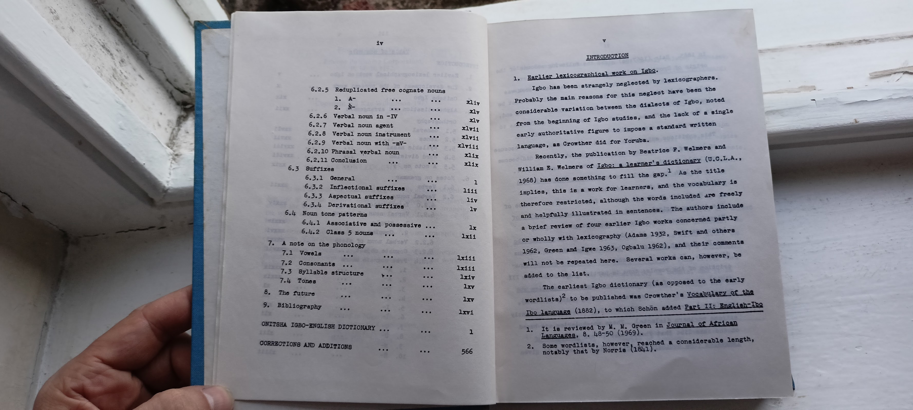
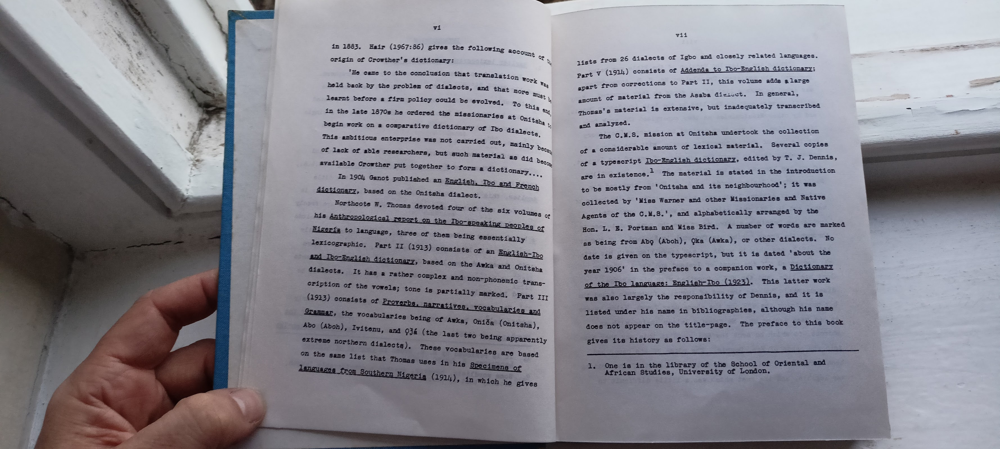
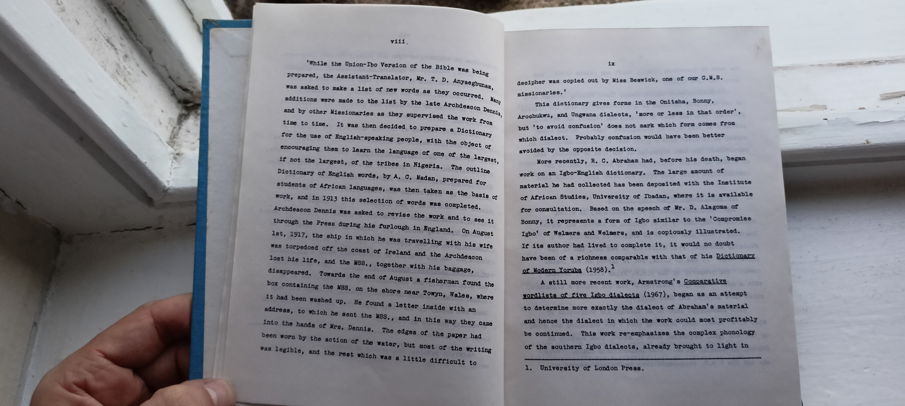

# Table of Contents contd. and Introduction

iv

6.2.5 Reduplicated free cognate nouns
1. A
2. N
6.2.6 Verbal noun in -IV
6.2.7 Verbal noun agent
6.2.8 Verbal noun instrument
6.2.9 Verbal noun with -mV
xlviii
6.2.10 Phrasal verbal noun
6.2.11 Conclusion
6.3 Buffixes
6.3.1 General 6.3.2 Inflectional suffixes
6.3.3 Aspectual suffixes 6.3.4 Derivational suffixes
6. Noun tone patterns
6.4.1 Associative and possessive
6.4.2 Class 5 nouns
7. A note on the phonology
7.1 Vowels
7.2 Consonants
7.3 Byllable structure
7.4 Tones
8. The future
9. Bibliography
ONITSHA IGBO-ENGLISH DICTIONARY 1
CORRECTIONS AND ADDITIONS 566

v

INTRODUCTION

1. Earlier lexicographical work on Igbo.

Igbo has been strangely neglected by lexicographers.
Probably the main reasons for this neglect have been the
considerable variation between the dialects of Igbo, noted from the beginning of Igbo studies, and the lack of a single
early authoritative figure to impose a standard written
language, as Crowther did for Yoruba.

Recently, the publication by Beatrice P. Welmers and William E. Welmers of Igho: a learner's dictionary (U.C.L.A., 1968) has done something to fill the gap." As the title implies, this is a work for learners, and the vocabulary is
therefore restricted, although the words included are freely and helpfully illustrated in sentences. The authors include
a brief review of four earlier Igbo works concerned partly
or wholly with lexicography (Adans 1932, Swift and others 1962, Green and Igwe 1963, Ogbalu 1962), and their comments will not be repeated here. Several works can, however, be
added to the list.

The earliest Igbo dictionary (as opposed to the early wordlists)2 to be published was Crowther's Vocabulary of the
Ibo language (1882), to which Schön added Part II: English-Ibo

----

1. It is reviewed by M. M. Green in Journal of African Languages, 8. 48-50 (1969).
2. Some wordlists, however, reached a considerable length, notably that by Norris (1841).

vi

in 1883. Hair (1967:86) gives the following account origin of Crowther's dictionary:

'He came to the conclusion that translation work was held back by the problem of dialects, and that more mist learnt before a fira policy could be evolved. To this in the late 1870s he ordered the missionaries at Onitsha begin work on a comparative dictionary of Ibo dialecte, This ambitious enterprise was not carried out, mainly bec of lack of able researchers, but such material as did beco available Crowther put together to form a dictionary....

In 190, Ganot published an English, Too and French dictionary, based on the Onitsha dialect.

Northcote E. Thomas devoted four of the six volumes of his Anthropological report on the Ibo-speaking peoples of Miserfs to language, three of them being essentially lexicographic. Part II (1913) consists of an English-Too and Too-English dictionary, based on the Awka and Onitaha dialects. It has a rather complex and non-phonemic trans cription of the vowels; tone is partially marked. Part III (1913) consists of Proverbs, narratives, vocabularies and Grass, the vocabularies being of Awka, Oniča (Onitsha), Abo (Aboh), Ivitemu, and 93á (the last two being apparently extreme northern dialects). These vocabularies are based on the same list that Thomas uses in his Specimens of Languages from Southern Nigeria (1914), in which he gives
lists from 26 dialects of Igbo and closely related languages. Part V (1914) consists of Addends to Tbo-English dictionarz; apart from corrections to Part 11, this volume adds a large amount of material from the Asaba dict. In general, Thomas's material is extensive, but inadequately transcribed and analyzed.

The C.M.S. mission at Onitsha undertook the collection of a considerable amount of lexical material. Several copies of a typescript Ibo-English dictionary, edited by T. J. Dennis, 1 are in existence." The material is stated in the introduction to be mostly from 'Onitsha and its neighbourhood'; it was collected by 'Miss Warner and other Missionaries and Native Agents of the C.M.8.', and alphabetically arranged by the Hon. L. E. Portman and Mise Bird. A number of words are marked as being from Abq (Aboh), çka (Awka), or other dialects. No date is given on the typescript, but it is dated about the year 1906' in the preface to a companion work, a Dictionary of the Too language: English-Too (1923). This latter work was also largely the responsibility of Dennis, and it is listed under his name in bibliographies, although his name does not appear on the title-page. The preface to this book gives its history as follows:

------
1. One is in the library of the School of Oriental and African Studies, University of London.

viii.

'While the Union-Ibo Version of the Bible was being prepared, the Assistant-Translator, Mr. T. D. Anyaegbunan, was asked to make a list of new words as they occurred. Many additions were made to the list by the late Archdeacon Dennis, and by other Missionaries as they supervised the work from time to time. It was then decided to prepare a Dictionary for the use of English-speaking people, with the object of encouraging them to learn the language of one of the largest, if not the largest, of the tribes in Nigeria. The outline Dictionary of English words, by A. C. Madan, prepared for students of African languages, was then taken as the basis of work, and in 1913 this selection of words was completed. Archdeacon Dennis was asked to revise the work and to see it through the Press during his furlough in England. On August 1st, 1917, the ship in which he was travelling with his wife was torpedoed off the coast of Ireland and the Archdeacon lost his life, and the MSS., together with his baggage, disappeared. Towards the end of August a fisherman found the box containing the M8S, on the shore near Towyn, Wales, where it had been washed up. He found a letter inside with an address, to which he sent the W88,, and in this way they came into the hands of Mrs. Dennis. The edges of the paper had been worn by the action of the water, but most of the writing was legible, and the rest which was a little difficult to
decipher was copied out by Miss Beswick, one of our C.M.8. missionaries.'

This dictionary gives forms in the Onitsha, Bonny, Arochukwu, and Ungwana dialects, 'more or less in that order', but to avoid confusion' does not mark which form comes from which dialect. Probably confusion would have been better avoided by the opposite decision.

More recently, R. C. Abraham had, before his death, began work on an Igbo-English dictionary. The large amount of material he had collected has been deposited with the Institute of African Studies, University of Ibadan, where it is available for consultation. Based on the speech of Mr. D. Alagoma of Bonny, it represents a form of Igbo similar to the 'Compromise Igbo of Welmers and Welmers, and is copiously illustrated. If its author had lived to complete it, it would no doubt have been of a richness comparable with that of his Dictionary of Modern Yoruba (1958).1

A still more recent work, Armstrong's Comparative wordlists of five Igbo dialecta (1967), began as an attempt to determine more exactly the dialeat of Abraham's material and hence the dialect in which the work could most profitably be continued. This work re-emphasizes the complex phonology of the southern Igbo dialects, already brought to light in

-------
1. University of London Press.

the work of Carnochan (1968), Swift and others (1962), d Green and Igve (1963).

It will be see that a common theme running through much of the work here surveyed is a pre-occupation with the dis probles. Only the work of Abraham and Welmers and Welaers attempts to deal with an unqualified Igbo". Of the other works, it is clear that a great deal of Onitsha material, in particular, has been collected at one time or another; that so little of it has reached print is probably due to the concentration first upon Union and later upon Central Igbo.
