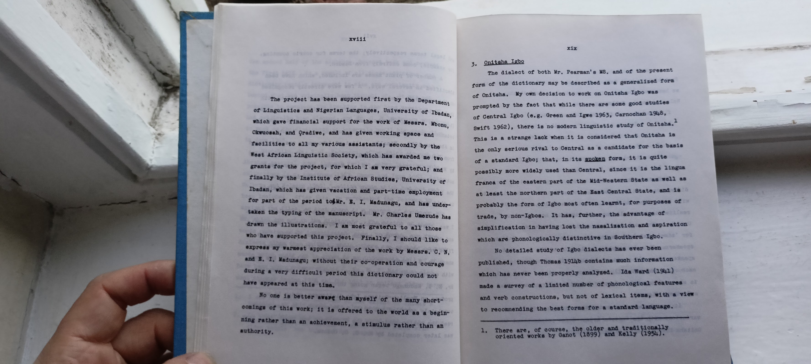

# The development of the present work

2. The development of the present work.

The immediate source of this dictionary is a long vocabulary compiled by G. W. Pearaan in several M8. copies. The copy I have made use of is written in blue ink in a foolscap notebook, with additions in red ink, and is 188 pages long. It has no title, but is marked on the inside Cover: 'The property of the C.M.8. Niger Mission, ONITSHA' with a note 'Copyright reserved!!' and the author's signature, dated once 12.9.56 and once 13.2.57.

This manuscript came to me through the suggestion of Miss M. M. Green, who, learning that I was beginning the study of Onitsha Igbo, requested Miss M. Munro, then working in Owerri, to send it to me. Miss Munro kindly did so. Both she and the C.M.8. representatives in Onitsha assured me
they had no objection to my revising and publishing this asterial, and this assurance was repeated by the Rev. G. W. Fears when I set his on my next visit to England in 1965.

During our meeting, Mr. Pearman told me that his work was based on that by T. J. Dennis. He added to the work of his predecessor, while omitting words which were not Onitsha or which he could not confirm. At a later date, after his transfer to Umushis, he added further words which are not necessarily correct in Onitsha; these are the red ink entries in the MS.

At first glance, I thought the publication of this MS. would be comparatively easy. The obvious course seemed to be to re-transcribe it from the Old orthography into the official orthography, check and where necessary re-write the tones, and eliminate any forms which were found to be not in current use in Onitsha.

The major difficulty that presented itself at this point was deciding which form of Onitsha Igbo to use. It was already obvious to me that there was considerable variety of dialect within Onitsha Province, which, on the basis of a quick check of a few pages in the MB., appeared to extend to

---
1. High and low tones were marked throughout. Both high and downatepped high were marked with the acute accent, although there was a separate list at the end of 5th Class Nouns, with downatepped high.

x11

vocabulary as well as to phonology. My original decision was to use the dialect of Onitsha Town itself, but it became obvious that in many respects this was a highly specialized dialect, different from the generalized 'Onitsha' which is widely understood and used. In the end, therefore, we ended up using a fairly general form, no doubt coloured by the individual dialects of the people who worked on the dictionary.

Initially, I checked a few pages of the dictionary manuscript with Mr. W. C. Mbonu, of Umuoji, and a larger number with Mr. B. Okwuosah, of Onitsha Town. After their graduation in 1965, I began to work more intensively on the dictionary with Mr. Oradiwe of Onitsha Town. The MS. was then typed out, exactly as it stood, but with a space left after each Igbo word, before the English translation, for the checked and re-transcribed form of it to be re-written.

Boon it became clear that some fairly drastic re
arrangement was called for, particularly among the verbs. Here, for example, is the section under -ba- as it stands in the MS. (the numbers at the left have been added for reference in what follows; the later entries in red ink are distinguished, as in the M8., by the use of =):

x111

Beginning, inception..
Verbal suffix sig.
going in, coming in.
-bà
2. do.
3. bà To enter.
4.
To peel, pare.
5. To be many.
6. bà ảnh To dig ground.
7.
bà n'ányh To intoxicate (of wine).

8. bà nwinyề To betroth.
9.
10. 11. bh n'ir6) bà dlù To be useful, profit, benefit.
12. To be stale (of food).

13.
14.
To shout at, rebuke, chide, scold.
To soak (corn etc.)
bábá
15. To pare.
16.
17.
18.
To enter together.
To be about to enter.

To enter deeply into.
To get worse.
19.
20.
bà mà ta To rub on chalk.
banyé
To join, enter, go in. To woo, court.
21. --banyé Verbal suffix sig. within, inside.
22. bànyéld About, concerning, of.
23. batá To enter, come in.
1. For some of the differences in phonology, see section 3 below.
1.
24. báwányé To increase.

xiv

It is obvious, first, that high and low tone entries should be separated. Then it is clear that among the high tone entries, nos. 5 and 24 are related, nos. 4 and 15 are related, while nos. 1, 6, and 13 represent different elements. Among the low tone elements, nos. 2, 3, 16, 17, 18, 20, 21, and 23 are clearly related, and nos. 7, 9, 10, 11, and 12 can also be connected with this group. The remaining low tone elements appear to be separate.

It was decided that the dictionary would be much clarified if groups of related words were placed together under a single root. We therefore adopted the following procedure; Mr. Gradiwe went through the typed-out words, cut them up individually, and pinned together those which he considered to be related. I then went through each pinned together group with him, re-transcribing each word according to his promunciation. We discarded items which he could not recognize, and added short examples to clarify the meaning in certain cases. After this, Mr. M. Igbozurike copied out each re-transcribed form or example on to a slip of paper. At the beginning of each group of slips, he wrote the root on a 3 x 5 card, which thus served as a head-word for the group. He then arranged the head-words, and the slips after each head-word, in alphabetical order. (It should be added that Mr. Igbozurike, being a speaker of Orlu and not of
Onitsha, was purely a scribe and did not serve as an informant.)

We had gone approximately half-way through the dictionary when I went on study leave to the U.8. from June 1966 to December 1966. When I returned in January 1967, Mr. Cradiwe had left the University as a result of the crisis. Boon afterwards, however, Mr. E. I. Madunagu, of Nnoobi, joined the project and completed the work of cutting up and pinning together the slips. At the beginning of the long vacation of 1967 he was joined by his senior brother, Mr. C. N. Madunagu.

Both brothers learnt to use the orthography, including the tone-marking system, that was being used in the dictionary. Mr. E. I. Madunagu then undertook the task of going through the Abraham M8. materials (see Section 1) to extract any foras with Onitsha cognates which were not already in the dictionary. Meanwhile, Mr. C. N. Madunagu proved to have a great aptitude for producing sentences which illustrated the meaning and use of words; the great majority of the examples are due to him. Their merit is that they are not translations from English, but natural Igbo sentences elicited only by the stimulus of the word they illustrate. The short essays which appear from time to time (e.g. under otùtù, gbanje) on aspects of culture. are also his work, as are the sketches which served as basis for the illustrations, a large number of new words, and various features of the arrangement. When he had finished

xvi

the second half of the alphabet, he went back and revised the first half. As a result of all these additions, the dictionary rapidly increased in size and complexity much beyond what had originally been thought of. It was not possible to complete the checking in the long vacation, as had originally been planned, and Mr. C. N. Madunagu continued to work on the dictionary at intervals until his graduation in June 1968.

Meanwhile, Mr. E. I. Madunagu, after going through the Abrahan material, went through various other lexicographic collections (e.g. Armstrong 1967, Green and Igwe 1963, later Welmers and Welmers 1968), adding words which had not yet been included. After this, he re-checked the Pearman S. against the files, so that there is a record of words in the MS. which are not in the dictionary. The status of these words remains to be investigated; some, no doubt, are from dialects other than Onitsha, while others are archaic or rare words which would not be known to my informants (all of whom have been young undergraduates.2 Mr. E. I. Madunagu also went through Basden 1938 and Obi 1963 to collect older terms

---
1. I was not aware at the time of the extent of Thomas's material, or this would have also been included.
2. It had originally been planned to spend part of the long vacation, 1967, in Onitsha to check these words with older people, but this was not possible.

xvii

and legal terms respectively; the terme for cowrie counting, for example, come entirely from Basden.

A number of plant names are included, which have been identified in several ways. A few were directly recognized on the campus at Ibadan, where many trees are labelled with their botanical names. Others were equated with Yoruba name a (both the Madunagu brothers are bilingual in Yoruba), and the botanical names were obtained by looking up the Yoruba names in Abraham 1958. Finally, a list of Igbo names was abstracted from Dalziel, The useful plante of West Tropical Africa (1937) by Miss P. N. Okwesa. Mr. E. I. Madunagu then consulted his mother about these names, correlated with the description of the plants, and some further identifications were obtained in this way.

In 1968 I began a final check through the complete files. I was, however, considerably interrupted by other commitments, and only completed this in the long vacation of 1969. The files were then sent to the Institute of African Studies, where Mr. E. Ohaegbu undertook the typing, which he has done with exceptional care and scrupulousness. In the meantime, Mr. B. I. Madunagu began going through the files in order to produce an English-Onitsha Igbo dictionary, which is now completely compiled but still to be edited. He also proof read the master-copies as the dictionary was typed; this task was later completed by Mr. C. O. Obiora.

xviii

The project has been supported first by the Department of Linguistics and Nigerian Languages, University of Ibadan, which gave financial support for the work of Messrs. Mbonu, Okwuosah, and Oradiwe, and has given working space and facilities to all my various assistants; secondly by the West African Linguistic Society, which has awarded me two grants for the project, for which I am very grateful; and finally by the Institute of African Studies, University of Ibadan, which has given vacation and part-time employment for part of the period tour. B. I. Madunagu, and has under taken the typing of the manuscript. Mr. Charles Umezude has drawn the illustrations. I am most grateful to all those who have supported this project. Finally, I should like to express my warmest appreciation of the work by Messrs. C. N. and S. I. Madunagu; without their co-operation and courage during a very difficult period this dictionary could not have appeared at this time.

No one is better aware than myself of the many short comings of this work; it is offered to the world as a beginning rather than an achievement, a stimulus rather than an authority.
