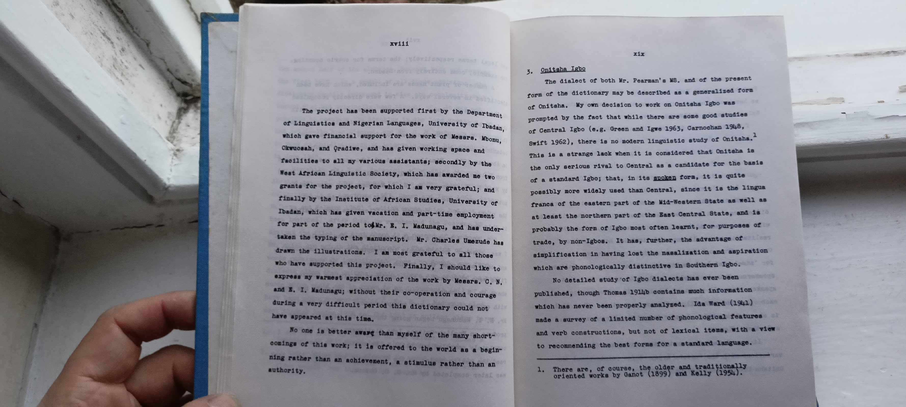
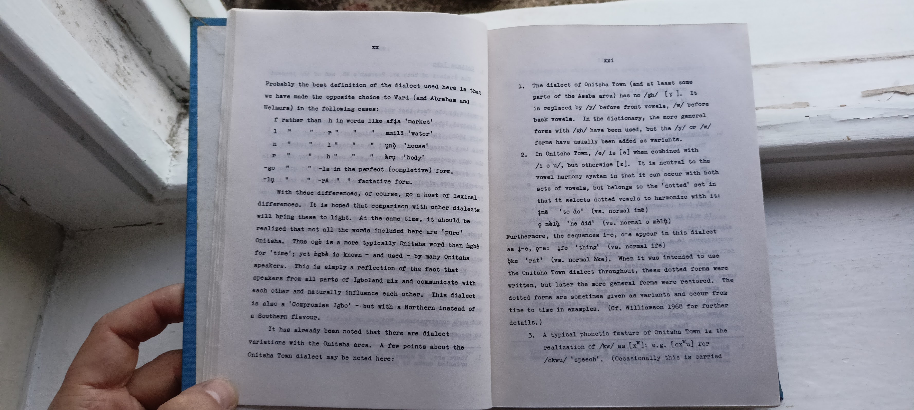

# Onitsha Igbo

xix

3. Onitsha Igbo

The dialect of both Mr. Pearman's MS, and of the present form of the dictionary may be described as a generalized form of Onitsha. My own decision to work on Onitsha Igbo was prompted by the fact that while there are some good studies of Central Igbo (e.g. Green and Igwe 1963, Carnochan 1948, Swift 1962), there is no modern linguistic study of Onitsha.1 This is a strange lack when it is considered that Onitsha is the only serious rival to Central as a candidate for the basis of a standard Igbo; that, in its spoken form, it is quite possibly more widely used than Central, since it is the lingua franca of the eastern part of the Mid-Western State as well as at least the northern part of the East Central State, and is probably the form of Igbo most often learnt, for purposes of trade, by non-Igbos. It has, further, the advantage of simplification in having lost the nasalization and aspiration which are phonologically distinctive in Southern Igbo.

No detailed study of Igbo dialects has ever been published, though Thomas 1914b contains much information which has never been properly analyzed. Ida Ward (1941) made a survey of a limited number of phonological features and verb constructions, but not of lexical items, with a view to recommending the best forms for a standard language.

-----

1. There are, of course, the older and traditionally oriented works by Ganot (1899) and Kelly (1954).

xx

Probably the beat definition of the dialect used here is that we have made the opposite choice to Ward (and Abraham and Welmers) in the following cases:

f rather than h in words like afia 'market'
mmill water'
und 'house' àry 'body' -la in the perfect (completive) form.
-TA factative form.

With these differences, of course, go a host of lexical differences. It is hoped that comparison with other dialects will bring these to light. At the same time, it should be realized that not all the words included here are 'pure' Onitsha. Thus ogè is a more typically Onitsha word than igbè for 'time'; yet hgbè ie known and used by many Onitsha speakers. This is simply a reflection of the fact that speakers from all parts of Igboland mix and communicate witho each other and naturally influence each other. This dialect is also a 'Compromise Igbo' - but with a Northern instead of a Bouthern flavour.

It has already been noted that there are dialect variations with the Onitsha area. A few points about the Onitsha Town dialect may be noted here:

1. The dialect of Onitsha Town (and at least some parts of the Asaba area) has no /gh/ [T]. It ав по is replaced by /3/ before front vowels, /w/ before back vowels. In the dictionary, the more general forms with /gh/ have been used, but the /3/ or // forms have usually been added as variants.
2. In Onitsha Town, /e/ 18 [e] when combined with /1 o u/, but otherwise [e]. It is neutral to the vowel harmony system in that it can occur with both seta of vowels, but belongs to the 'dotted' set in that it selects dotted vowels to harmonize with it: 'to do' (vs. normal ině)
mel 'he did' (vs. normal o mal)

Furthermore, the sequences 1-e, ore appear in this dialect
as 1-0, gre: ire 'thing' (ve. normal ife) oke 'rat' (vs. normal oke). When it was intended to use the Onitsha Town dialect throughout, these dotted forms were written, but later the more general forms were restored. The dotted forms are sometimes given as variants and occur from time to time in examples. (Cr. Williamson 1968 for further details.)

3. A typical phonetic feature of Onitsha Town ia the realization of /xw/ au [x]: e.g. [ox"u] for /okwu/ 'speech'. (Occasionally this is carried